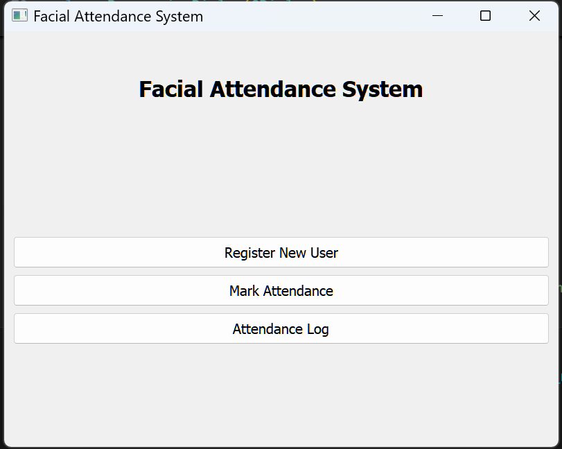
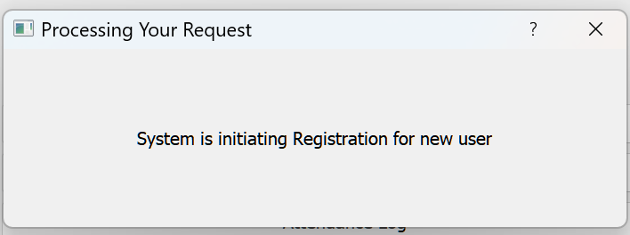
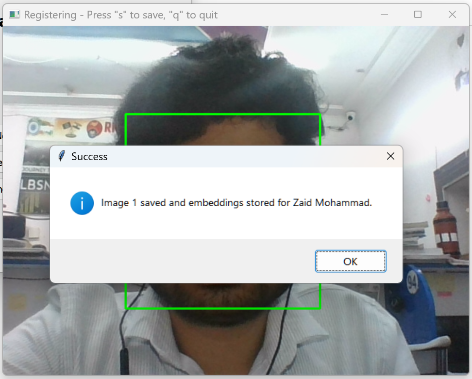
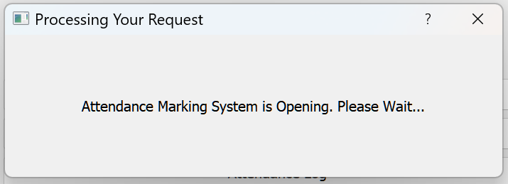
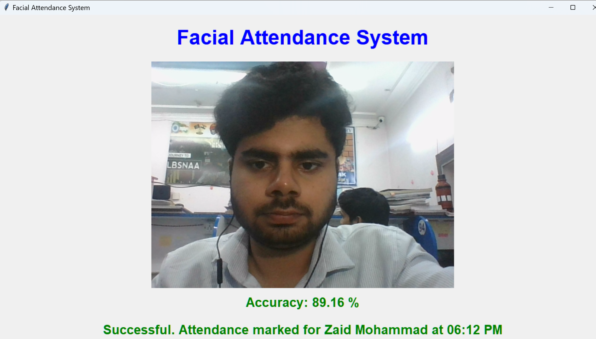
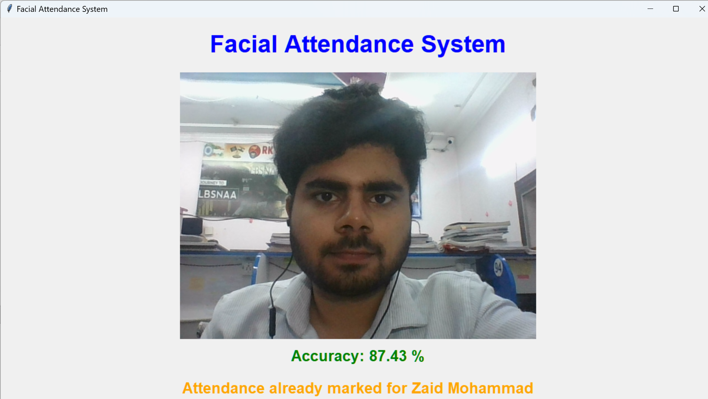
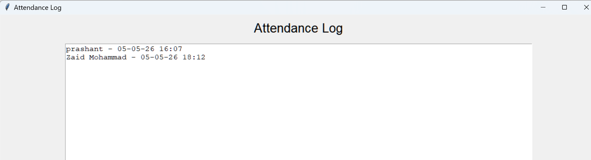

# 📸 Facial Attendance System

A robust AI based **Facial Recognition-Based Attendance System** designed to automate user registration, identification, and attendance tracking using deep learning and computer vision techniques. The system integrates real-time face recognition with an intuitive GUI to deliver a seamless attendance experience.

---

# 📑 Table of Contents

* [Overview](#-overview)
* [🖼️ UI Preview](#%EF%B8%8F-ui-preview)
* [Features](#-features)
* [System Architecture](#-system-architecture)
* [Project Structure](#-project-structure)
* [Modules Description](#-modules-description)
* [Data Processing Pipeline](#%EF%B8%8F-data-processing-pipeline)
* [Face Recognition Methodology](#-face-recognition-methodology)
* [Tech Stack Used](#%EF%B8%8F-tech-stack-used)
* [How to run this project](#%EF%B8%8F-how-to-run-this-project)

---

# 📌 Overview

This project implements an **end-to-end facial attendance system** that:

* Registers users via facial data capture
* Extracts and stores face embeddings
* Recognizes users in real-time
* Logs attendance with timestamps
* Prevents duplicate attendance entries

The system leverages **Deep Learning-based embeddings** for accurate face matching and integrates multiple Python libraries for UI, processing, and storage.

---
# 🖼️ UI Preview

### 📍 Application Screens

### Main Interface :


### User Registration Screen :


### Registration Successful :


### Attendance Marking Initiation :


### Successful Attendance Marking :


### Duplicate Attendance Handling :


### Attendance Log Viewer :



---
# ✨ Features

* Real-time face detection and recognition
* DeepFace-based embedding extraction
* Cosine similarity-based identity matching
* Duplicate attendance prevention (same-day restriction)
* GUI-based interaction (PyQt5 + Tkinter)
* Efficient preprocessing (grayscale, resizing, FFT)
* Structured storage of embeddings and attendance logs

---

# 🧠 System Architecture

```
User → Camera Capture → Preprocessing → Embedding Extraction
     → Similarity Matching → Attendance Logging → UI Display
```

---

# 📁 Project Structure


```bash
facial-attendance-system/
│
├── data/
│   └── attendance_log.csv        # Stores attendance records with timestamps
│
├── faces/                        # Captured user face images
│
├── images/                       # UI screenshots used in README
│
├── model/
│   └── mtcnn.py                  # MTCNN face detection model
│
├── scripts/
│   ├── register.py               # User registration and embedding generation
│   ├── recog.py                  # Real-time face recognition and attendance marking
│   └── attendance_log.py         # Attendance log viewer interface
│
├── main.py                       # Main PyQt5 application interface
│
├── embeddings.csv                # Stored facial embeddings with usernames
├── requirements.txt              # Project dependencies
├── README.md                     # Project documentation
│
└── .gitignore                    # Ignored files and folders
```

---

# 🧩 Modules Description

## 🖥️ Main Interface

* Built using **PyQt5**
* Acts as the central control panel
* Integrates all modules via **subprocess execution**
* Uses **threading** for smooth UI responsiveness

---

## 🧾 User Registration

**Libraries Used:** DeepFace, MTCNN, OpenCV, PIL, Tkinter

**Workflow:**

1. Capture user face image
2. Detect face using **Haar Cascade**
3. Apply preprocessing:

   * Grayscale conversion
   * Image resizing
   * FFT transformation
4. Generate facial embeddings using DeepFace
5. Store:

   * Image → `faces/`
   * Embeddings → `embeddings.csv`

---

## 🎯 User Recognition

**Libraries Used:** OpenCV, DeepFace, MTCNN, Tkinter, Threading

**Workflow:**

1. Capture live video feed via OpenCV
2. Apply preprocessing:

   * Grayscale
   * Resizing
   * FFT transformation
3. Extract embeddings
4. Compare with stored embeddings using **cosine similarity**
5. Apply threshold:

   * ≥ 85% → Match found
   * < 85% → Unknown user

**Logic Handling:**

* If match found → Log attendance with timestamp
* If attendance already exists (same day):

  * UI automatically closes on reattempt
* If no match:

  * Display "User not found"

---

## 📊 Attendance Log Viewer

**Libraries Used:** Tkinter, OS module

* Displays attendance records
* Extracts data from stored files
* Simple UI for viewing logs
* Uses basic file operations for retrieval and display

---

# ⚙️ Data Processing Pipeline

1. Face Detection (Haar Cascade / MTCNN)
2. Image Preprocessing:

   * Grayscale conversion
   * Size normalization
   * FFT transformation
3. Feature Extraction using DeepFace
4. Storage & Retrieval using CSV
5. Matching via cosine similarity

---

 🔍 Face Recognition Methodology

* **Embedding Model:** DeepFace (Facenet)
* **Similarity Metric:** Cosine Similarity
* **Threshold:** 85%

**Matching Logic:**

```
If cosine_similarity ≥ 0.85:
    (User Identified)
Else:
    User Not Found
```

---

# 🛠️ Tech Stack Used

* Python
* OpenCV
* DeepFace
* MTCNN
* PyQt5
* Tkinter
* PIL (Pillow)
* NumPy / Pandas
* CSV for storage

---


# ▶️ How to run this project


### 1️⃣ Clone the Repository


git clone https://github.com/zaidmo50/real-time-face-attendance-deepface.git

cd deepface-attendance-system

---

### 2️⃣ Create a Virtual Environment

python -m venv venv

---

### 3️⃣ Activate the Virtual Environment

#### Windows

venv\Scripts\activate

#### Linux / macOS

source venv/bin/activate

---

### 4️⃣ Install Dependencies

pip install -r requirements.txt

---

### 5️⃣ Run the Application

python main.py

---

### 📌 Notes

- Ensure webcam access is enabled
- Good lighting improves recognition accuracy
- First register users before attempting recognition
- Attendance is restricted to one entry per user per day

---


## 📎 Contact Details

* Author &nbsp;&nbsp;: Zaid Mohammad Khan
* Email &nbsp;&nbsp;&nbsp;&nbsp;: zmk745@gmail.com
* Linkedin : [Zaid-Mohammad](https://www.linkedin.com/in/zmk745/)
---


⭐ If you find this useful, consider giving a star!